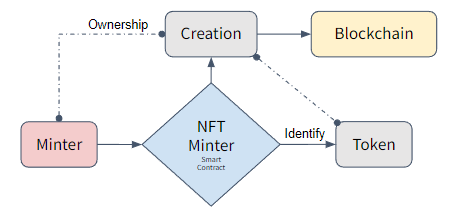

# Artistic-NFT

The application integrates Ethereum’s ERC-721 protocol and the InterPlanetary File System (IPFS) to provide durable, decentralized storage solutions, thus ensuring a reliable management framework for digital artworks. Designed with ReactJS, the platform offers an intuitive interface that supports the activities of uploading, purchasing, and reselling artwork. Given the rapid expansion of the NFT market, which increasingly attracts artists to transform their works into NFTs, this platform serves the growing digital artist and collector community.

The project illustrates the effective use of blockchain in securing artwork and contributes to the broader research on blockchain-driven solutions for managing digital assets safely.

---

The design and implementation of a decentralized NFT marketplace encapsulates smart contracts, server-side logic, and front-end components. Based on the framework of the marketplace on [DappUniversity](https://github.com/dappuniversity/nft_marketplace).

## Design and Implementation

### 1. Smart Contracts
Our 2 smart contracts written in Solidity, form the basic architecture of the marketplace:

- NFT Contract: Handles the creation (minting) of unique digital assets. Each NFT is tied to a URI stored on IPFS, ensuring that the asset's metadata is immutable and decentralized.
- Marketplace Contract: Manages the buying and selling of NFTs. It supports basic marketplace functionalities, such as listing items for sale and conducting transactions with built-in security features like the ReentrancyGuard.

Both contracts leverage the OpenZeppelin library to ensure compliance with ERC-721 standards and enhance security features. These contracts are deployed on the local Ethereum network using Hardhat, which simplifies development tasks like compiling, testing, and deploying.

#### NFT Contract
The NFT smart contract inherits from the OpenZeppelin library's ERC721URIStorage. This design choice allows the contract to manage non-fungible tokens with associated URIs, enabling the storage of metadata such as image, name, and description linked to each NFT. The contract defines basic functionalities such as minting new NFTs, where each token minted is uniquely identified and linked to a URI provided by the user. The mint function increments a tokenCount with each new token, assigns the token to the creator, and sets the token's URI.



#### Marketplace Contract
The Marketplace contract incorporates several security and utility features to facilitate the buying and selling of NFTs. It imports the ERC721 interface for NFT compatibility and ReentrancyGuard from OpenZeppelin to prevent reentrancy attacks (a common vulnerability in smart contracts). The marketplace maintains a list of items for sale, each represented as a 'struct' containing details such as item ID, NFT contract address, token ID, price, seller, and sale status. Key functionalities include:

- Listing NFTs for Sale: Sellers can list their NFTs by specifying the token ID and price. Each listing is recorded with a unique item ID and emits an event when created. NFTs can be resold anytime when the holders want to offer them in the marketplace.
- Buying Listed NFTs: Buyers can purchase available NFTs directly from the listing by paying the specified price. The smart contract handles the transfer of ownership and funds, deducting a predefined fee that goes to a fee account. A purchase will also emit an event to the blockchain.


Both contracts use event logging to facilitate tracking transactions and changes on the blockchain, enhancing transparency and auditability. The marketplace contract's use of immutable variables for critical settings like the fee percentage and fee account ensures that these parameters cannot be altered after deployment, promoting trust in the platform's operations.
These contracts together provide a simple but robust framework for creating, selling, and buying digital assets securely on the blockchain.

### 2. Server-Side Logic

The server acts as an intermediary between the front-end and the decentralized storage solution, IPFS. It is implemented using Node.js with Express and several middlewares:
- Multer: Handles file uploads from the front end.
- Axios: Facilitates API requests to Pinata Cloud[10] for pinning files to IPFS.
- CORS: Ensures our server can securely handle requests from different origins.

When a user opts to mint an NFT, the server receives the file, uploads it to IPFS via Pinata, and returns the IPFS hash as a tokenURI. This URI, pointing to the NFT metadata, is used in the smart contract to mint the NFT, ensuring that the metadata is accessible and permanent.


### 3. Front-End Implementation
Our front-end is developed using React, providing a dynamic and responsive user interface. It interacts with the smart contracts through ethers.js, which facilitates communication with the Ethereum blockchain. The front end is structured around several components:
- App.js: Manages routing and global state, including user accounts and contract instances.
- Home.js: Displays available NFTs and handles purchase transactions.
- Create.js: Allows users to mint new NFTs, interfacing with the server for file uploads and metadata handling.
- MyArtifacts.js and MyPurchases.js: Allow users to view and manage their NFTs and purchases, respectively.

The application uses React Router for navigation and Bootstrap for styling, ensuring a user-friendly experience across various devices.

### 4. Interactions and Flow
The typical user flow involves connecting a MetaMask wallet, minting new NFTs through the Create component, and listing these NFTs for sale. Users can browse available NFTs on the Home page and purchase them. All transactions are signed and initiated through MetaMask, ensuring security and user control.

The server supports this flow by handling the heavy file uploads and IPFS integration, abstracting these complexities from the front end. This setup not only optimizes the user experience by minimizing transaction costs (gas fees) associated with storing large files on the blockchain, but also maintains the decentralized integrity of the application.


The integration of Solidity smart contracts, a Node.js server, and a React front-end creates a robust and secure platform for trading NFTs. This architecture not only leverages the Ethereum blockchain for decentralized transactions, but also ensures that NFT metadata remains immutable and accessible through IPFS, supported by a user-friendly interface.

## Features

### NFT Creation/Minting:
- Users can create (mint) NFTs by providing essential details such as a name, description, and an image file.
- The image file is uploaded to IPFS via the server, ensuring decentralized and permanent storage.
- The metadata including the IPFS link to the image is stored as part of the NFT on the Ethereum blockchain.


### Marketplace Functionality:
- The Marketplace page dynamically displays all NFTs that are currently available for sale.
- NFTs are listed with their metadata fetched from IPFS, ensuring that all displayed information is up-to-date.


### Management of Minted NFTs:
- Creators can view their minted NFTs on the 'MyArtifacts' page.
- This page provides details on both sold and currently available NFTs, allowing creators to track their creations.


### Buying and Selling:
- Buyers can purchase available NFTs directly from the Marketplace.
- Upon purchase, the ownership of the NFT transfers to the buyer, and the NFT is then listed on their 'My Purchases' page.


### Reselling of Purchased NFTs:
- Purchased NFTs can be resold by specifying a new price and using the resell function.
- This functionality encourages active trading and liquidity within the marketplace.


## LIMITATIONS AND FUTURE WORK

### Current Limitations

The application currently faces several limitations, which may affect the user experience and scale of the application.  One significant issue is the high gas costs associated with minting and transferring NFTs if further implemented on the Ethereum mainnet, which might discourage frequent use. Additionally, the front-end performance also deteriorates with the NFT collection since the frontend fetches all the available NFTs to display them, making the loading times of them longer. The platform also misses advanced search and filter options, which makes it difficult for users to fetch a particular NFT from the growing inventory. Furthermore, the absence of community participation features weakly enforces user interaction in the marketplace. Lastly, with platform growth, it will need deep security testing to guarantee that the smart contracts and the server-side implementations are strong against any possible security liabilities.

### Proposed Enhancements and Future Works
To overcome these limitations and enhance the platform’s capabilities, several upgrades are proposed. Addressing the inefficiency of high gas costs could involve implementing solutions like lazy minting or utilizing Layer 2 solutions to reduce expenses and improve transaction efficiency. Enhancing the front-end scalability might include integrating pagination or infinite scrolling, which would help manage the display of a large number of NFTs more efficiently and improve load times. Employing caching strategies could further optimize data retrieval and reduce redundancy in data fetching.

Developing a more robust filtering system that allows users to search for NFTs based on parameters such as price, minting date, and categories, along with a full-text search feature, would significantly enhance the discoverability of NFTs. The introduction of user profiles could facilitate the tracking of individual activity and the display of owned or created NFTs, enhancing user engagement. Social features like forums, comment sections, or integration with social media platforms, alongside the ability to track NFT history, would not only foster a sense of community but also enrich the user experience by providing more depth and context to the NFTs.

If development is promoted even further, regular security audits conducted by third parties and extensive testing, including stress and penetration testing, are crucial to ensure the robustness and security of all components. Considering smart contract upgradability using proxies could also provide a way to make improvements and fix bugs without losing the current state or requiring a complete migration of assets.


---
---
Steps to proceed in Terminal in order to run the project

## 0. mpn install
Before running or modifying the project, install all dependencies

## 1. npx hardhat compile
to compile smart contracts

## 2. npx hardhat node
to get available nodes to start with

### 2.1 by default, we use 1st node to deploy smart contract

## 3. npx hardhat run src/backend/scripts/deploy.js --network localhost
In Metamask-> Networks -> Add network -> Add a network manually
Settingset up address as http://127.0.0.1:8545, and chain ID in 31337
we deploy the smart contract into testnet

## 4. ~~npm run start~~
~~to open dapp on explorer~~
## 4. npm run dev
run together with backend  

## npx hardhat console --network localhost
to open console to interact with smart contract

## 5. Notes
### in case the balance is not updated, we can use the following command to update the balance
### to test expected balance w/o confirmation in hardhat console

```
const [add0, add1] = await ethers.getSigners();
const ba0 = await add0.getBalanc();
const ba1 = await add1.getBalanc();
console.log(ethers.utilsformatEther(ba0), "ETH");
console.log(ethers.utilsformatEther(ba1), "ETH");
```

